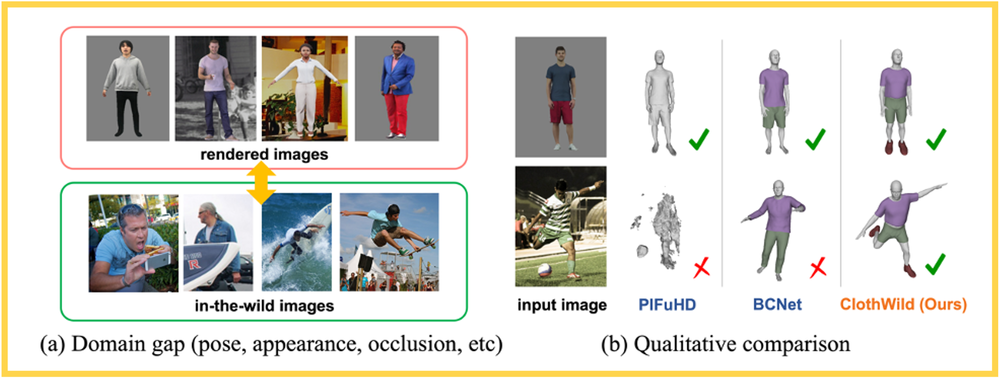
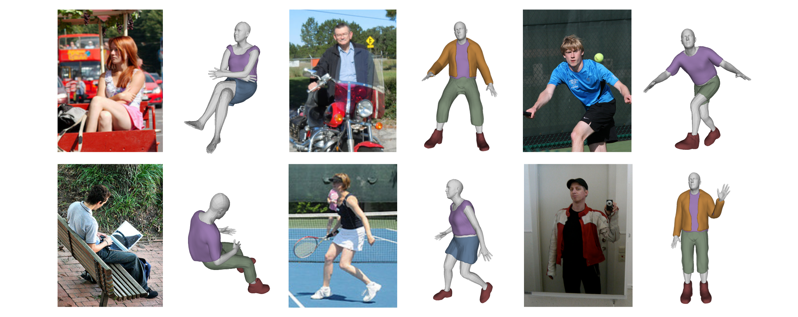
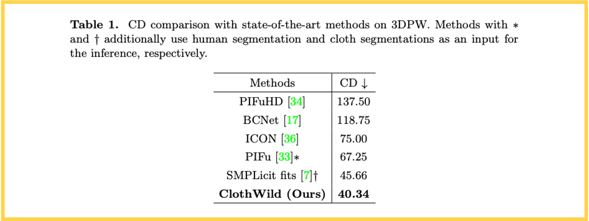

# **3D Clothed Human Reconstruction in the Wild (ClothWild codes)**

> [**3D Clothed Human Reconstruction in the Wild**](https://arxiv.org/abs/2207.10053),            
> Gyeongsik Moon, 
> Hyeongjin Nam,
> Takaaki Shiratori,
> Kyoung Mu Lee,        
> *European Conference on Computer Vision (ECCV), 2022*

<p align="center">  
  
</p> 
<p align="center">  
  
</p> 

## Installation
* We recommend you to use an [Anaconda](https://www.anaconda.com/) virtual environment. Install PyTorch >=1.8.0 and Python >= 3.7.0. 
* Install Pytorch3d following [here](https://github.com/facebookresearch/pytorch3d/blob/main/INSTALL.md) depending on your environment.
* Then, run `sh requirements.sh`. You should slightly change `torchgeometry` kernel code following [here](https://github.com/mks0601/I2L-MeshNet_RELEASE/issues/6#issuecomment-675152527).


## Quick demo
* Download the pre-trained weight from [here](https://drive.google.com/drive/folders/1IzIlnu8sHtnuNHGWnghrFkf8bbZyTOHq?usp=sharing) and place it in `demo` folder.
* Prepare `base_data` folder following below [`Directory`](./assets/directory.md/#required-data) part.
* Prepare `input.png` and edit its `bbox` of `demo/demo.py`.
* Prepare SMPL parameter, as `pose2pose_result.json`. You can get the SMPL parameter by running the off-the-shelf method [[code](https://github.com/mks0601/Hand4Whole_RELEASE/tree/Pose2Pose)].
* Run `python demo.py --gpu 0`.


## Directory
Refer to [here](./assets/directory.md).


## Running ClothWild

### Train 
In the `main/config.py`, you can change datasets to use.

```
cd ${ROOT}/main
python train.py --gpu 0
``` 

### Test 
Place trained model at the `output/model_dump` and follow below.

To evaluate CD (Chamfer Distance) on 3DPW, run
``` 
cd ${ROOT}/main
python test.py --gpu 0 --test_epoch 7 --type cd
``` 

To evaluate BCC (Body-Cloth Correspondence) on MSCOCO, run
``` 
cd ${ROOT}/main
python test.py --gpu 0 --test_epoch 7 --type bcc
``` 

You can download the checkpoint trained on MSCOCO+DeepFashion2 from [here](https://drive.google.com/drive/folders/1IzIlnu8sHtnuNHGWnghrFkf8bbZyTOHq?usp=sharing).


## Result
Refer to the [paper](https://arxiv.org/abs/2207.10053)'s main manuscript and supplementary material for diverse qualitative results!

### Chamfer Distance (CD)

<p align="center">  
  
</p> 

### Body-Cloth Correspondence (BCC)

<p align="center">  
  
</p> 

## Reference  
```  
@InProceedings{Moon_2022_ECCV_ClothWild,  
author = {Moon, Gyeongsik and Nam, Hyeongjin and Shiratori, Takaaki and Lee, Kyoung Mu},  
title = {3D Clothed Human Reconstruction in the Wild},  
booktitle = {European Conference on Computer Vision (ECCV)},  
year = {2022}  
}  
```
